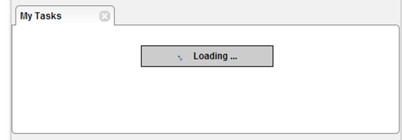

# Asynchronous Loading

## Default behaviour

Asynchronous loading is a feature that has been introduced in TACTIC
4.1. Its introduction is the result of a shift in the philosophy of
TACTIC user interface design. In this new direction, UIs are expected to
be more fluid and responsive.

As of TACTIC 4.1, loading new tabs and links now looks like the picture
above. The browser window is still useable during this animation -
another link can be clicked in the meantime, for example.

As well, all TACTIC tables load asynchronously: the first 5 rows
initially load and the rest of the table is loaded in groups of 10. This
allows you to begin working on the table straight away.

## Asynchronous Loading in the Custom Layout Editor

As of TACTIC 4.1, the Custom Layout Editor supports asynchronous loading
of views. Element tags now support a 'load' attribute, with three
options.

<table>
<colgroup>
<col width="16%" />
<col width="84%" />
</colgroup>
<thead>
<tr class="header">
<th>Option</th>
<th>Description</th>
</tr>
</thead>
<tbody>
<tr class="odd">
<td>
inline (default)
</td>
<td>
Load the element with its parent custom layout.
</td>
</tr>
<tr class="even">
<td>
sequence
</td>
<td>
Load the element after the parent layout is loaded, in sequence with other elements using this option.
</td>
</tr>
<tr class="odd">
<td>
async
</td>
<td>
Behave similarly to 'sequence', but all elements using this option send a request to begin loading as soon as the parent layout is loaded.
</td>
</tr>
</tbody>
</table>

'Sequence' and 'async' both cause the element to load after the custom
layout that contains them loads, allowing a user to begin working before
the particular element has loaded.

The difference between 'sequence' and 'async' is only apparent once
multiple elements are using these attributes. For example, if a view
named 'my\_view' has two elements, 'view1' and 'view2', which are loaded
using the sequence option (as below), 'my\_view' would first load, with
loading placeholders for 'view1' and 'view2'. Once 'view1' loads,
'view2' would begin loading.

    <element load='sequence' view='view1'/>
    <element load='sequence' view='view2'/>

If instead both elements were using 'async', two requests would be sent
once 'my\_view' loads so both elements would begin loading at the same
time.

The decision to use 'async' or 'sequence' depends on the scenario. Both
allow the parent view to load faster, so their use is recommended. Using
'async' generally decreases the total load time on all elements in a
view, but it also causes all the server requests to happen
simultaneously.
