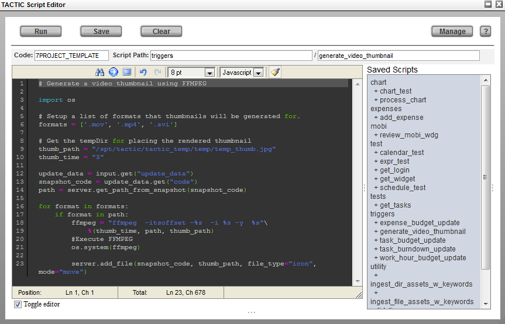
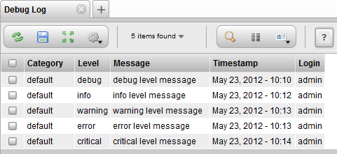
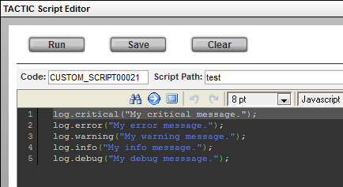
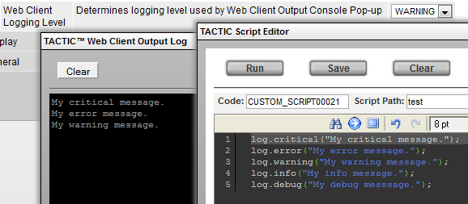

# The TACTIC Script Editor

## Outputting to the Debug\_Log Table With The TacticServerStub.log() Function

The TACTIC Script Editor allows for Javascript and Python based scripts
to be written and stored in a "custom script" sObject. These scripts
harness the power of Javascript in the web browser along with the power
of the Python TACTIC Client API. They can be structured to run on a
general execution, by a trigger or, they can be attached to a button to
execute for a specific sObject.

One of the main benefits with using this method of custom scripting in
TACTIC is that the script writer does not have to have direct access to
the server’s file system.

The TacticServerStub.log() method writes to the table named 'debug\_log'
in the sthpw database.

The first parameter of the TacticServerStub.log() method is named
**level**. The argument for **level** can be one of the following keywords:

<table>
<colgroup>
<col width="16%" />
<col width="83%" />
</colgroup>
<tbody>
<tr class="odd">
<td>
<strong>level</strong>
</td>
<td>
critical
</td>
</tr>
<tr class="even">
<td>
error
</td>
<td>
warning
</td>
</tr>
<tr class="odd">
<td>
info
</td>
<td>
debug - arbitrary debug level category
</td>
</tr>
</tbody>
</table>

The TacticServerStub.log() method can be used as follows:

    var server = TacticServerStub.get()
    server.log('debug','My log message for the debug group.')

The debug level argument provides the convenience of grouping the Debug
Log table by debug levels. This table can be found under:

**Admin Views → Server → Debug Log**

> **Note**
>
> These 5 debug levels are arbitrary.
>
> The only purpose the levels serve are to group the messages when they
> are sorted in the table.

## Outputting to the TACTIC Web Client Output Log With The log Methods

While writing scripts in the TACTIC Script Editor, messages can be
output to the **Web Client Output Log**.

Below are the 5 Javascript methods in use. The most vocal method,
log.critical(), is at the top:

Below is the Output Log console from above the sample script. It can be
found under:

**Main Gear menu → Tools → Web Client Output Log**.

The level of the log messages which appear in the Javascript Output
Client Log can be controlled. The level can be adjusted under: **My Admin
→ User Preferences**.

Below is a table to illustrate what the setting for each level will
display

<table>
<colgroup>
<col width="16%" />
<col width="83%" />
</colgroup>
<thead>
<tr class="header">
<th><strong>critical setting</strong></th>
<th>only display messages that are from log.critical()</th>
</tr>
</thead>
<tbody>
<tr class="odd">
<td>
<strong>error setting</strong>
</td>
<td>
only display messages that are from log.critical() or log.error()
</td>
</tr>
<tr class="even">
<td>
<strong>warning setting</strong>
</td>
<td>
only display messages that are from log.critical() or log.error() or log.warning()
</td>
</tr>
<tr class="odd">
<td>
<strong>info setting</strong>
</td>
<td>
only display messages that are from log.critical() or log.error() or log.warning() or log.info()
</td>
</tr>
<tr class="even">
<td>
<strong>debug setting</strong>
</td>
<td>
only display messages that are from log.critical() or log.error() or log.warning() or log.info() or log.debug()
</td>
</tr>
</tbody>
</table>

For example, if the Web Client Logging Level is set in the preferences
to the **warning** level, we will only see messages that are from
log.warning(), log.error() and log.critical(). ie. Only messages at the
same level or above that level will be displayed in the Web Client
Output Log.

## Client API JavaScript Samples

**Example 1: Insert A New sObject**

    // INSERT A NEW SOBJECT

    var server = TacticServerStub.get();

    var code = "truck";
    var asset_name = "truck";
    var description = "A model of a truck.";
    var search_type = "toy_factory/lego_set";
    var project = "toy_factory";
    var data = {
        'code': code,
        'name': asset_name,
        'description': description
    };

    var search_key = server.build_search_key(search_type, code, project);
    var result = server.insert(search_type, data);
    log.debug(result);

*Results after insert:*

**Example 2: Get An sObject by Its Search Key**

    // GET BY SEARCH_KEY
    var server = TacticServerStub.get();

    var search_type = "toyrus/lego_set";
    var code = "model_crane";
    var project = "toyrus";

    var search_key = server.build_search_key(search_type, code, project);
    var result = server.get_by_search_key(search_key);
    alert(result.description);
    server.log("debug", result);

*Results after get\_by\_search\_key():*

**Example 3: Update An Existing sObject**

    // UPDATE EXISTING SOBJECT

    var server = TacticServerStub.get();

    var code = "model_crane";
    var project = "toyrus";
    var asset_name = "model crane";
    var description = "Revised description of a crane.";
    var search_type = "toyrus/lego_set";
    var data = {
        'code': code,
        'name': asset_name,
        'description': description
    };
    var search_key = server.build_search_key(search_type, code, project);
    var result = server.update(search_key, data);
    server.log("debug", result);

*Results after update:*\*Example 4: Retire An Existing sObject\*

    // RETIRE AN EXISTING OBJECT

    var server = TacticServerStub.get();

    var search_type = "toyrus/lego_set";
    var code = "model_crane";
    var project = "toyrus";

    var search_key = server.build_search_key(search_type, code, project);
    var results = server.retire_sobject(search_key);
    server.log("debug", result);

*Results after retire:*
