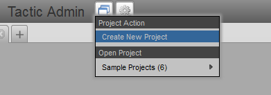
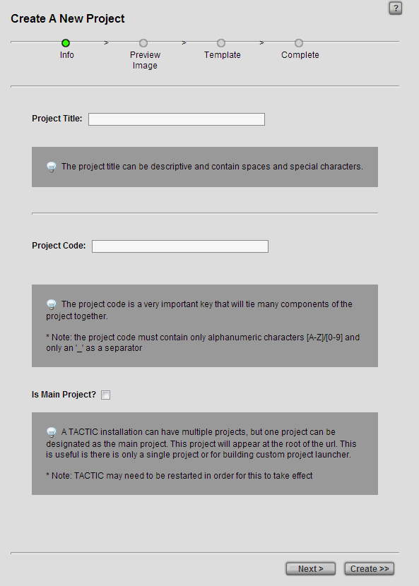
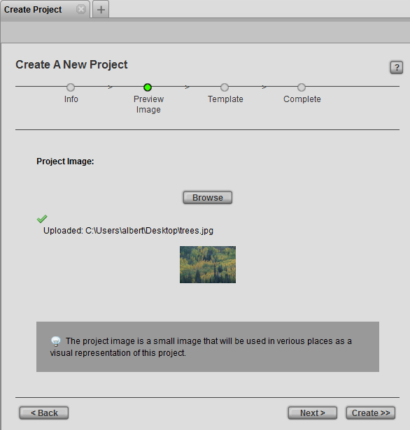
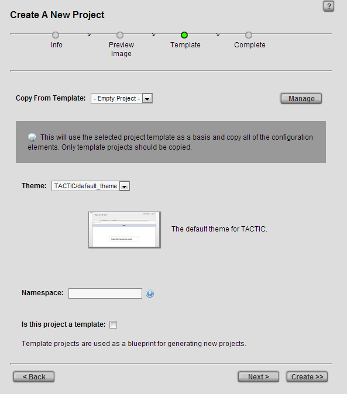
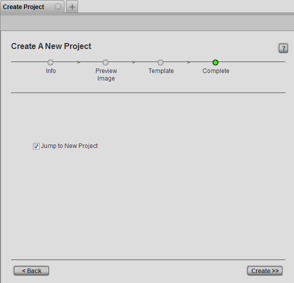
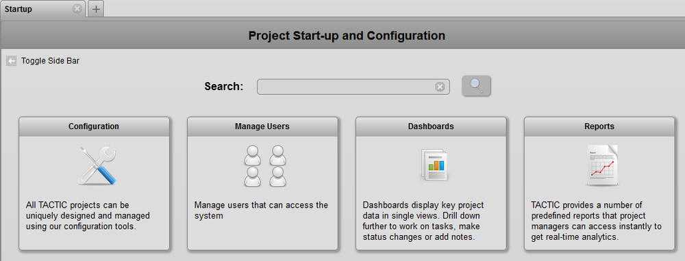

# Create a New Project

## Stepping Through the Create a New Project Wizard

To create a new project in TACTIC, go to the top header and from the
**Project Menu**, select **Create Project**. The Create New Project wizard
will open.

In the **Create New Project Wizard**, specify the **Project Title** and hit
tab to go to the next field. Notice that a suggested **Project Code** is
automatically filled in. The **Project Code** can be changed but it must
only contain alphanumeric characters and only an underscore as a
separator. Click **Next** to continue specifying more details or click
**Create Project** to create the project with the defaults.

Next, browse to select a **thumbnail** image to represent the project
(optional):

Next, specify a template to use to create the project. Otherwise, the
empty project will be used by default.

You can also pick a theme to use for your project. The theme specifies
the display that your project uses initially. It defines the
presentation layer when you open your project page. The admin side of
the project is not affected by the theme you select.

Indicate if this new project will be used as a project template. (The
default is no checkmark):

Finally, confirm and create the new project by clicking the **Create**
button:

## Create Project Options

<table>
<colgroup>
<col width="35%" />
<col width="64%" />
</colgroup>
<tbody>
<tr class="odd">
<td>
<strong>Project Title</strong>
</td>
<td>
The <strong>Project Title</strong> is displayed in many places in the TACTIC interface. Choose a human readable string, like the full project title, so that it is understandable to all users.
</td>
</tr>
<tr class="even">
<td>
<strong>Project Code</strong>
</td>
<td>
A suggested <strong>Project Code</strong> is automatically generated once the*Project Title* has been entered. This code is a unique identifier for the project that should only contain alphanumeric characters or the underscore &quot;_&quot; character. This code is used in many areas in the database which tie all elements of the production together. For this reason, a <strong>Project Code</strong> cannot be changed after the project has been set up and saved after completing the wizard.
</td>
</tr>
<tr class="odd">
<td>
<strong>Copy From Template</strong>
</td>
<td>
This option facilitates and speeds up the creation of a new project from an existing project. The <strong>Copy From Template</strong> option creates a new copy of all your project records to the new template project, such as asset libraries, task records, pipelines and workflow configurations. Once the new project has been created, the admin user can then make any additional modifications required to suit their new project. Please note that only template projects should be copied.
</td>
</tr>
</tbody>
</table>

## Accessing Projects from a Web Browser

The new project can be access from the web browser using the URL:

    http://(server)/projects/(code)/

For example, for a project with the code "test" on a server called
"tactic", the URL would be:

    http://tactic/projects/test/

## Project Startup and Configuration

Once the new project has been created, the **Startup** view will
automatically appear. This view provides guidance on how to set up a
project.

To continue through the Project Startup view, please see the doc titled
**Can a New Project Be Undone?**.

Unlike most operations in TACTIC, when a new project is created, it is
not easily undo-able. It not easily undo-able because of the following
complex actions that took place:

1.  It creates the database for the project and copies the schema
    designated for this type of project.

2.  It creates project sites in the sites directory.

3.  It registers the site in TACTIC.

If a project is accidentally created, then it is best to **delete** the
project immediately.
