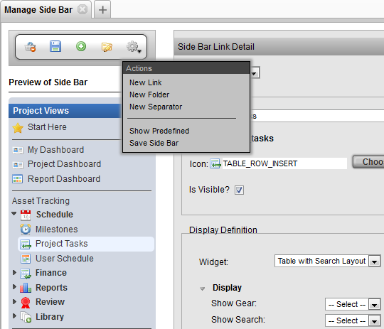
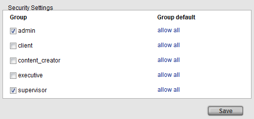
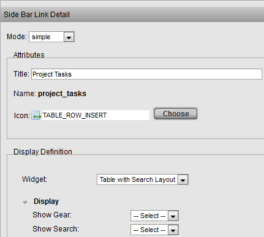
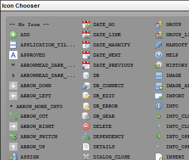
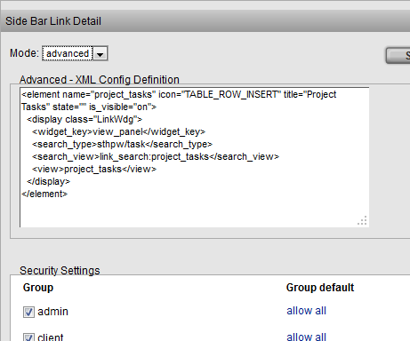
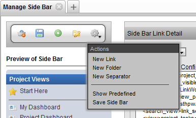
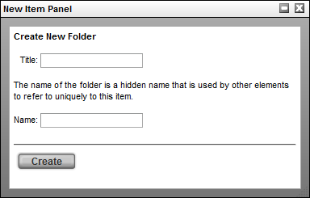
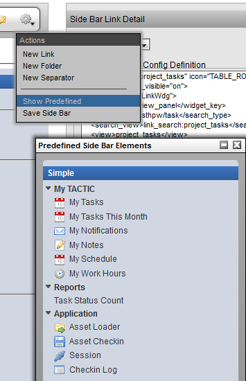
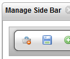

# Managing the Sidebar

## Introduction

The sidebar is a menu of views created by the administrator to present
information on the items in TACTIC. Examples of views include: Asset
Tracking, User Schedules, Milestones, Project Tasks, Expenses List,
Budget, File Usage Report, Burndown Report, etc.

The tool to manage the sidebar can be found under:

**Admin Views → Project Admin → Manage Sidebar**

The Manage Side Bar view is divided into 3 panels:

-   **Tool Shelf** - Quick links to access sidebar tools.

-   **Preview of Sidebar** - Re-arrange the elements in the sidebar by
    dragging and dropping.

-   **Element detail** - First, select a link from the preview of the Side Bar. Then, this panel allows for editing of the link element’s properties.

## Preview of Side Bar

The Preview Side Bar panel allows for changes to be made and tested
before committing to the actual sidebar. The following is a list of
actions that can be carried out in the preview panel:

-   Drag Links into folders

-   Rearrange Links and Folders

-   Rearrange separators

-   Drag links and folders into the trash for removal

-   Selection of a link or folder to edit the properties or security

## Side Bar Link Detail

When editing the properties of a link, at the bottom of the Side Bar
Link Detail panel are security settings. This section provides the
opportunity to select which groups can see and the folder or the link.
Changes to security to other users take effect when those users refresh
their sidebar.

The security section provides a method of simplifying what is presented
to team members of different user groups. The security settings behaves
in a hierarchical manner. If a specific security is applied to a folder,
its child links will inherit the same security setting. The security
settings are applied at runtime (i.e. the child link does not have the
security saved to it).

The Side Bar Link Detail panel allows for editing of Link properties in
either simple or advanced mode.

After choosing the groups which should access a link, click the Save
Definition to apply the security.

> **Note**
>
> The security configuration settings are saved as XML access rules and
> can be found under: **Admin Views → Site Admin → Groups**

## Simple Mode

In simple mode, the following aspects can be edited:

-   **Title:** The title of the Link.

-   **Icon:** An icon can be selected in the interface below by clicking the
    **Choose Icon** button

    

## Advanced Mode

Advanced mode shows the raw XML used to configure the Link Element. The
element is saved to the definition view for the sidebar.

## Action Menu

The project views manager **Action Menu** provides links to tools for
managing the sidebar.

### New Entry

The Add new link option adds a new link to the sidebar which is linked
to the default table view for the chosen Search Type

### New Folder

{: style="width: 50%"}

Adds a new folder to the sidebar. Items can be dragged into the new
folder in the pop-up then saved or, Items can be dragged into the folder
at anytime in the editor.

### New Separator

Adds a new separator to the sidebar, these a can be used to further
organize the folders and links

### Add Predefined

{: style="width: 50%"}

The predefined views are delivered as part of a project module. These
predefined project can be utilized to expedite the setup process.

If the project is a custom (simple) project, only the **My Tactic** views
will be available.

### Save

Saves the current state of the Temp side bar. Clicking the save icon
{: style="width: 20%"}
will also save the state.
