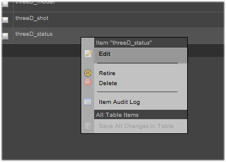

# Project Workflow Introduction

The **pipeline** defines all of the processes and deliverables required in
the creation of an item, and is the central entity that ties the whole
production together. In simple terms, a pipeline is simply a definition
of workflow processes.

In TACTIC, the pipeline workflow is used to lay out the steps which a
particular Searchable Type (sType) needs to follow as it flows through
its processes. Searchable Objects (sObjects) in TACTIC are by nature
like static containers or place holders that contain everything that
relates to them. When this content needs to be organized, managed and
produced as a part of a workflow, this is where a pipeline comes into
play. A Pipeline allows for this item "container" to be placed on a
digital conveyor belt where it will stop at each process and will be
filled with Tasks, Notes, Snapshots (checked in files) and more. On top
of this, the contents are tagged with this process allowing for a
separate history representing each stop on the conveyor belt.

## Workflow Concepts

At the very beginning, a clear diagram should be defined of the
processes, their relationships to each other and the deliverables
between each of the processes.

Each **sType** can have its own pipeline(s), so you create different
pipelines for different sTypes.

The best approach to building a pipeline is to start simple, processes
can always be added later. Overall, the general concept for defining the
processes in a pipeline, is to break down each place where separate file
versioning, tasks and notes will need to be generated and tracked

Simply put: you have a series of processes, named in any way you wish.
Each process is often represented by a task assigned to a user which
needs to be worked on. The completion of a process occurs when this task
complete (often indicated by setting it to a final status ie approved,
complete etc). While this task is in progress, files will be checked in
and notes will be tracked as the process is worked on.

## Status

Each process also contains a set of possible "statuses" which which
typically a used by the tasks. For example the "model" process can have
a possible status of (Waiting, Ready, In Progress, Revise, Review,
Approved, Client approved). Each status helps track the current state of
the process and are often the spawning point of automatically setting
downstream and upstream process status, sending automated notifications
and using the python triggers, etc.

## Subcontext (advanced)

At times there may need to be a further breakdown within a process, this
can be achieved through using a **subcontext**. Sub-contexts are used for
departments to check-in and track work and progress internally without
other departments needing to interact withe the content. For example, in
the case of a VFX process in a shot pipeline, someone checking in files
may be able to add extra specification (subcontext) such as
VFX/dynamics, VFX/water, or VFX/smoke. Another situation is where
multiple variation of something need to be checked in. For example you
may need a "red" and a "blue" design so the subcontexts for a design
checkin would be design/red and desing/blue.
