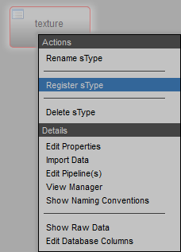
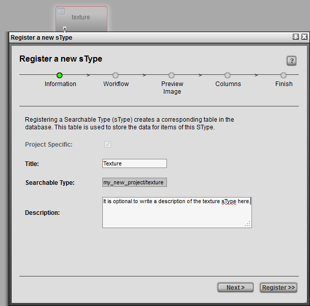
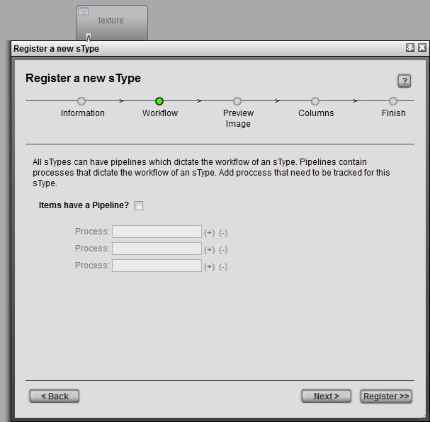
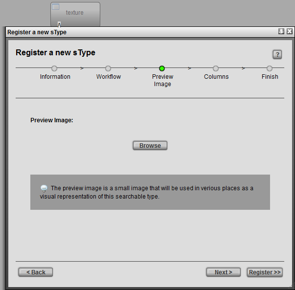
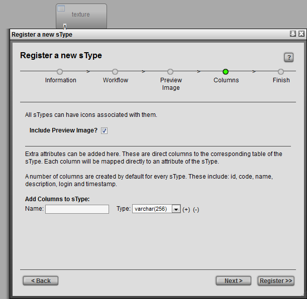
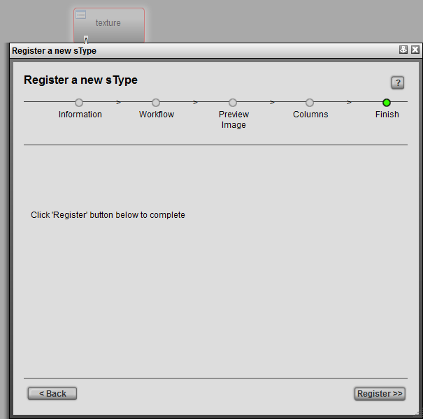

# Register sTypes

**sTypes** (also know as **Search Types**) can be registered either: one at
a time, or in batch. The benefit of registering each sType individually
is the opportunity to configure and select properties of the new sType
that are outside of the TACTIC defaults.

To register an sType, right click on the node to bring up the context
menu and choose **Register sType**.

{: style="width: 50%"}

The **Register a new sType** wizard will appear:

## Information

<table>
<colgroup>
<col width="50%" />
<col width="50%" />
</colgroup>
<tbody>
<tr class="odd">
<td>
<strong>Project Specific</strong>
</td>
<td>
<em>(available when creating a new sType for a project that is based on a template)</em>
</td>
</tr>
<tr class="even">
<td>
<strong>Title</strong>
</td>
<td>
The title for the sType is used in the UI for display purposes.
</td>
</tr>
<tr class="odd">
<td>
<strong>Searchable Type</strong>
</td>
<td>
Refers to the database name for the sType. in a &quot;&lt;project&gt;/&lt;name&gt;&quot; format. If no project is defined (i.e.. &quot;art/&quot;) than the current project namespace will be used.
</td>
</tr>
<tr class="even">
<td>
<strong>Description</strong> <em>(optional)</em>
</td>
<td>
An optional description of the sType.
</td>
</tr>
</tbody>
</table>

Once the fields are completed, press "Next" or press "Register" to
complete the registration process. Note: It is recommended to go through
the series of steps outlined in the "Register a new sType" wizard, as
this allows for quick and easy configuration of the new sType that is
outside of the TACTIC defaults.

## Workflow

<table>
<colgroup>
<col width="50%" />
<col width="50%" />
</colgroup>
<tbody>
<tr class="odd">
<td>
<strong>Items have a Pipeline?</strong>
</td>
<td>
When selected, sets up an association for a pipeline workflow for the sObjects in that sType. <em>The section below describes this relationship in more detail</em>
</td>
</tr>
<tr class="even">
<td>
<strong>Process</strong> <em>(optional)</em>
</td>
<td>
Stages in the process. <em>eg. processes for an asset sType: design, model, texture, rigging eg. processes for a shot sType: layout, animation/fx, lighting, render, comp</em>
</td>
</tr>
</tbody>
</table>

## Preview Image

<table>
<colgroup>
<col width="51%" />
<col width="48%" />
</colgroup>
<tbody>
<tr class="odd">
<td>
<strong>Preview Image</strong> <em>(optional)</em>
</td>
<td>
Browse to select a preview image for the new sType.
</td>
</tr>
</tbody>
</table>

## Columns

<table>
<colgroup>
<col width="50%" />
<col width="50%" />
</colgroup>
<tbody>
<tr class="odd">
<td>
<strong>Include Preview Image?</strong>
</td>
<td>
Preview image for each item (sObject) of that sType.
</td>
</tr>
<tr class="even">
<td>
<strong>Add Columns to sType</strong> <em>(optional)</em>
</td>
<td>
During the registration process, default columns are added to the new sType table. You can also add additional columns during this process. Note - columns can be added after this process using the Table Manager
</td>
</tr>
</tbody>
</table>

## Finish

<table>
<colgroup>
<col width="50%" />
<col width="50%" />
</colgroup>
<tbody>
<tr class="odd">
<td>
<strong>Finish</strong>
</td>
<td>
To complete the registration process, press &quot;Register&quot;. A this point, the option is provided to go back and change any information by clicking on the &quot;Back&quot; button.
</td>
</tr>
</tbody>
</table>

