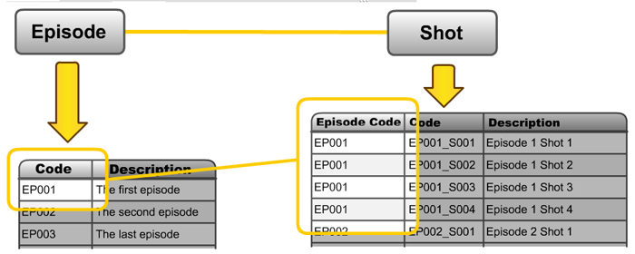
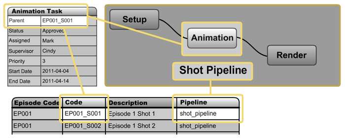

# TACTIC Anatomy Lesson

## What is TACTIC and how is it all put together?

TACTIC is a project-based system that can be configured to accommodate
the custom requirements of many different project scenarios.

Any project or asset management scenario can have a large number of
items to manage. These items can be people, files, tasks or information
and the management of these items are often a hurdle. The primary goal
of TACTIC is to assist in generating placeholders, controlling workflow
and managing these items.

## The TACTIC Server

The Tactic server is a system which runs the TACTIC application.  This
server is often housed in your facility as a website which runs on your
private network, or can be opened up to the world wide web like any
other website.

For Tactic to run there are 4 main services:

<table>
<colgroup>
<col width="27%" />
<col width="72%" />
</colgroup>
<tbody>
<tr class="odd">
<td>
<strong>Database Server</strong>
</td>
<td>
<strong>This is where Tactic stores all of the meta data</strong> The &quot;database is the base location for all of your data. This data is all information often tracked in spreadsheets, emails, sticky notes, whiteboards etc. A database provides a powerful central location for this information which helps keep everything in one place.
</td>
</tr>
<tr class="even">
<td>
<strong>File server</strong>
</td>
<td>
<strong>This is were TACTIC stores the files</strong> Files in TACTIC are managed externally on a file system. For example, most businesses have a file server that users save to. The file server typically has a root 'assets' directory where TACTIC handles the directory and filenames for the entire file system.
</td>
</tr>
<tr class="odd">
<td>
<strong>TACTIC Application</strong>
</td>
<td>
<strong>This is the central hub for all processing</strong> All processes and interactions are managed through TACTIC transaction system. The TACTIC Application sends/retrieves information from the database, and files from the File Server. TACTIC’s web interface can be delivered in multiple configurations based on the needs of the end user.
</td>
</tr>
<tr class="even">
<td>
<strong>Web Server</strong>
</td>
<td>
<strong>The Web Server delivers the interface to the end user</strong> The Web Server delivers the TACTIC Interface to the end user’s web browser. The Web Server is a web portal to the TACTIC Application.
</td>
</tr>
</tbody>
</table>

## What is a TACTIC Project?

A TACTIC project stores all inserted information and configuration. In
the back-end, each project is a complete "database".

**There are 2 major components to a TACTIC Project database; Setup
(configuration) and Meta Data**

**Project configuration** - Each TACTIC project can be unique based on the
desired end-user experience. TACTIC is extremely configurable which make
various end-user workflows possible.

**Project Information (Meta Data)** - Once you have a project setup and
configured, it stores all that data in the project. Because all data is
centralized in a database, it makes real-time updates and collaboration
on project tasks possible.

Tactic can house multiple projects at the same time with each being a
separate project configuration.  Within a project, there can be a
hierarchy of different types of objects in your project design.

## Project Structure

There are 2 major components to setting up the base structure of a
TACTIC Project:

-   The **Project Schema** which represents **what you manage and produce,
    and how these objects relate to each other**.

-   The **Project Workflow** which represents **processes and workflows these
    objects travel through during their life-cycle**

## Project Schema

<table>
<colgroup>
<col width="24%" />
<col width="75%" />
</colgroup>
<tbody>
<tr class="odd">
<td>

</td>
<td>
The project Schema is the central hub for traversing a project, and is the most important aspect of the project setup. The Schema node (sType), is a type of object you manage. i.e.. episodes, shots, sound.

For example, a television series may have multiple episodes, and each episode may have multiple shots. By relating Episodes to Shots, this will display all shots in a particular episode in one TACTIC view.

The layout of a Project Schema will depend on how the project is managed and how the sTypes relate to each other.
</td>
</tr>
</tbody>
</table>

## Project Workflow

The Project workflow is a layout of a pipeline processes.  Each pipeline
defines a set of processes that a single object can travel through.
These pipelines also represent the dependencies between the processes.
For example, each process inherently knows which processes are upstream,
and which are downstream. This can be leveraged with automated
notifications, emails, status updates and external trigger processing
tools.

The Project Schema and the Project Workflow Editor are connected. The
Schema is used to layout the sTypes individually, and the Work-flow
Editor is used to create the pipelines the sTypes will flow through.

## Searchable Types(sType)

**What are "sTypes"?**

Within the schema for a project there are various "types" of manageable
objects that are defined when a node is created. These items are called
Searchable Types (sTypes). Each of these Types are actually a table in
the database and each column represents a property relevant to that
sType.

A project configuration can have various views, pipelines, naming
conventions, access rules etc, which are all defined based on an
assignment to a sType.

**Searchable Objects(sObjects)**

What are **Searchable Objects (sObjects)** and how are they related to
**sTypes**?

Searchable Object or sObjects are the entries in the sType’s table. Each
entry can be thought of as a 'container' or 'placeholder' for the object
it represents ( a shot, an episode, a document etc). For example, Shot
EP001\_S003 is the sObject, which we can see is an entry in the Shots
table (sType) on the right.

## Common TACTIC sTypes

TACTIC provides a set of default sTypes:

-   **Tasks**

    Tasks can be created based on the pipeline associated to a particular sObject. Tasks provide tracking for various processes such as; Status
    changes, Start and End date, Assigned User, Assigned Supervisor, etc.
     Users can be provided with a view that displays all assigned tasks,
    when each task is due, and what tasks to expect in the future etc.

-   **Snapshots**

    When you check in a file, it may involve one file or it might be 1000 files. A snapshot represents a complete package of that sObject at the
    point of check-in. Snapshots store the version and revision information,
    as well as the location of the file(s) in the file system. Snapshots can
    also store "dependencies" to other Snapshots. Dependencies provide a
    trail to indicate that one check-in is dependant on one or more other Snapshots.

-   **Notes**

    Notes can be added to any task or snapshot and provide instant feedback
    and real-time collaboration between end users. These Notes and update
    information can be sent to the user via TACTIC Notifications and/or email.

Within an object being tracked in TACTIC (shot, episode, document etc),
separate child objects are stored and categorized by a '**process**'. For
example, the "design" process has notes, tasks, snapshots etc. All of
these would be stored within the shot EP001\_S001. Through this concept,
all of the life-cycle information regarding an object is easily
accessible and organized and more importantly are used to drive the
object through it’s pipeline.

## TACTIC Interface

**Searching for Types of Objects**

TACTIC interface allows users to search for information (sObjects) in
the TACTIC system. End users are able to quickly find and display
information relevant to their day-to-day tasks. The information can be
displayed in a variety of ways such as simple tabular data, dynamic
reporting or dashboards for example.
